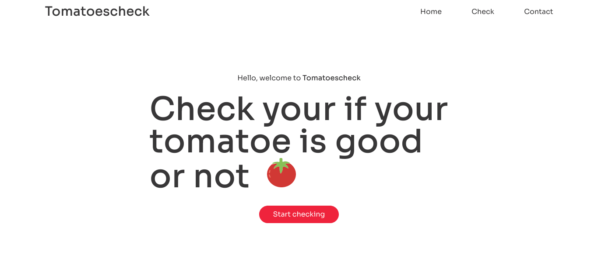
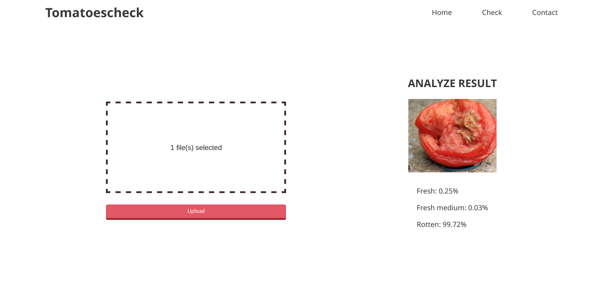

**Tomatoescheck**

**Description:**

Tomatoescheck is a web application designed to assist in determining the freshness of tomatoes. Using machine learning, the application classifies tomatoes into three categories: fresh, semi-fresh, and rotten.

This project utilizes Flask, a micro web framework for Python, and TensorFlow, an open-source machine learning framework, to provide an easy-to-use interface. Users can simply upload an image of the tomato they wish to classify, and the model will analyze it, providing the freshness classification.

**Features:**

- Easy-to-use web interface.
- Fast and accurate tomato freshness classification.
- TensorFlow model for image classification.

**Screenshoot**



**How to use:**

1. Clone this repository to your local machine.
   
   ```bash
   git clone https://github.com/LucaZH/tomatockeck.git
   ```

2. Install the required Python packages.
   
   ```bash
   pip install -r requirements.txt
   ```

3. Run the Flask application.
   
   ```bash
   python app-web.py
   ```

4. Open your web browser and go to `http://localhost:5000`.

5. Click to the button start checking

6. Upload an image of the tomato you want to classify.

**Contributing:**

Contributions are welcome! If you'd like to add features, fix bugs, or improve the code, feel free to open a pull request.